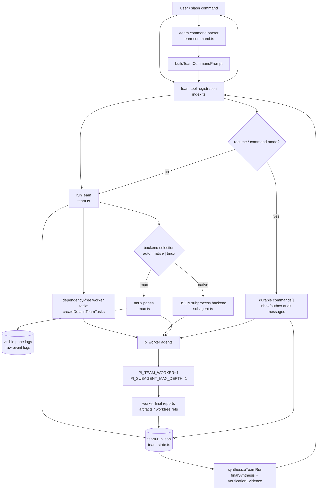

# Team Mode Architecture

This diagram summarizes the current lightweight team mode flow in `extensions/agentic-harness`.

Key boundaries:

- `index.ts` exposes the root-only `team` tool and `/team` command; team workers suppress recursive orchestration.
- `team.ts` owns task creation, backend selection, worker dispatch, lifecycle transitions, synthesis, and tmux cleanup policy.
- `team-state.ts` persists durable run records, task events, audit messages, and follow-up command lifecycle.
- `subagent.ts` executes native worker processes; `tmux.ts` creates readable worker panes and logs for tmux-backed runs.
